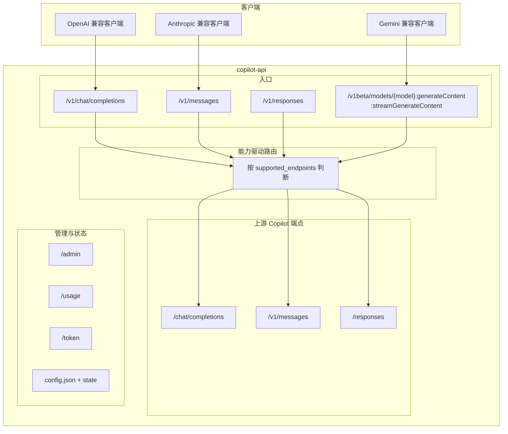
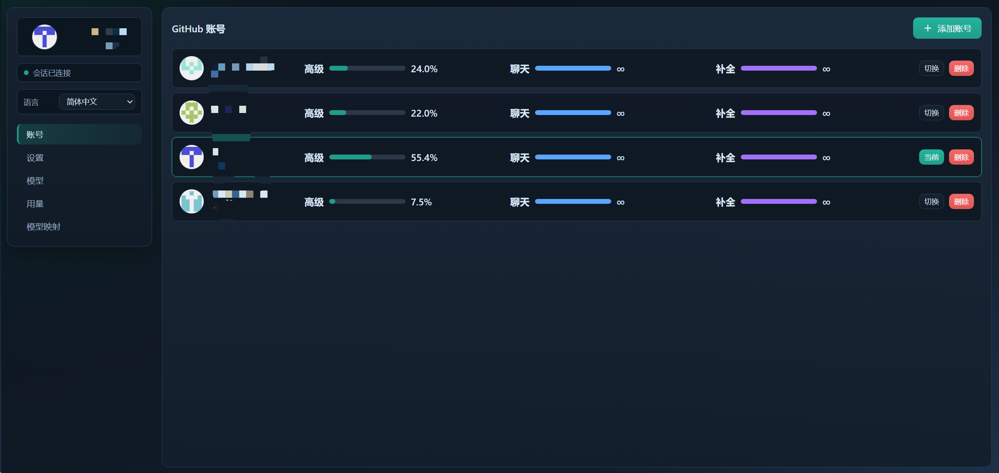
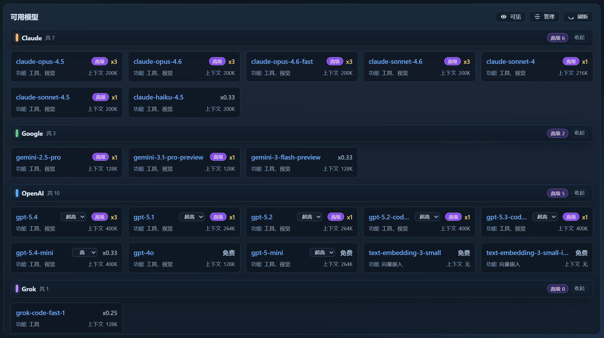
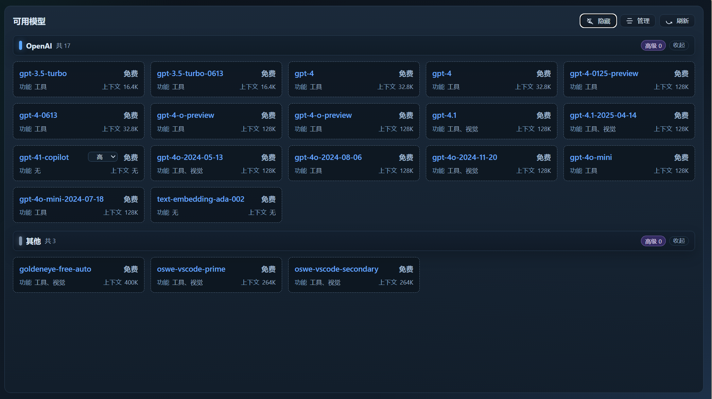
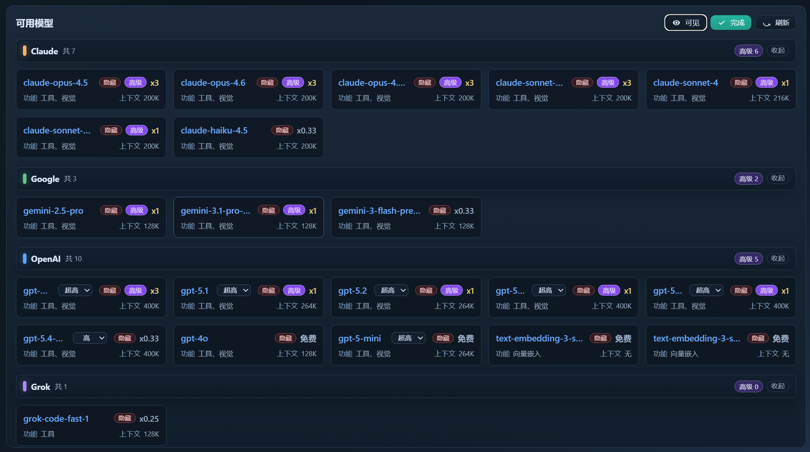
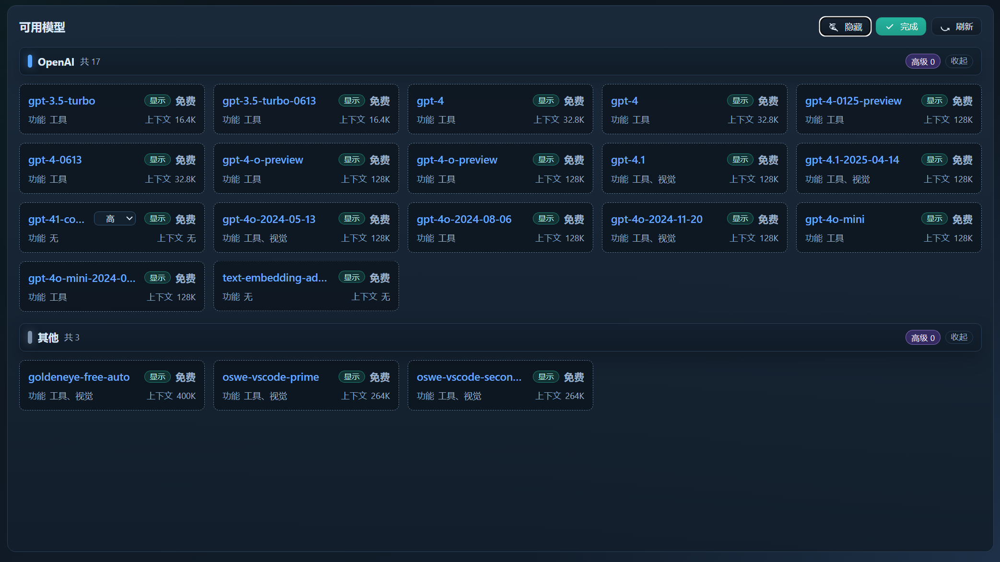
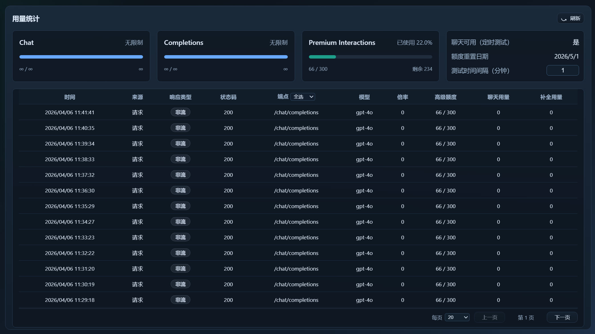
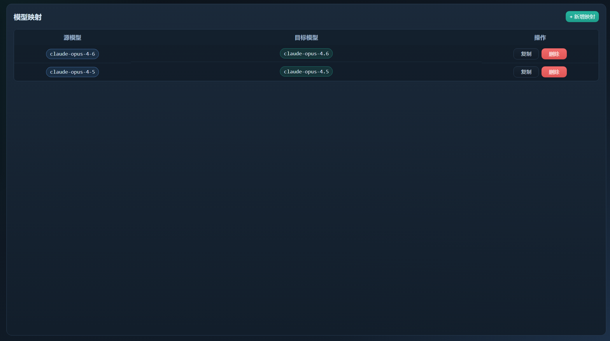
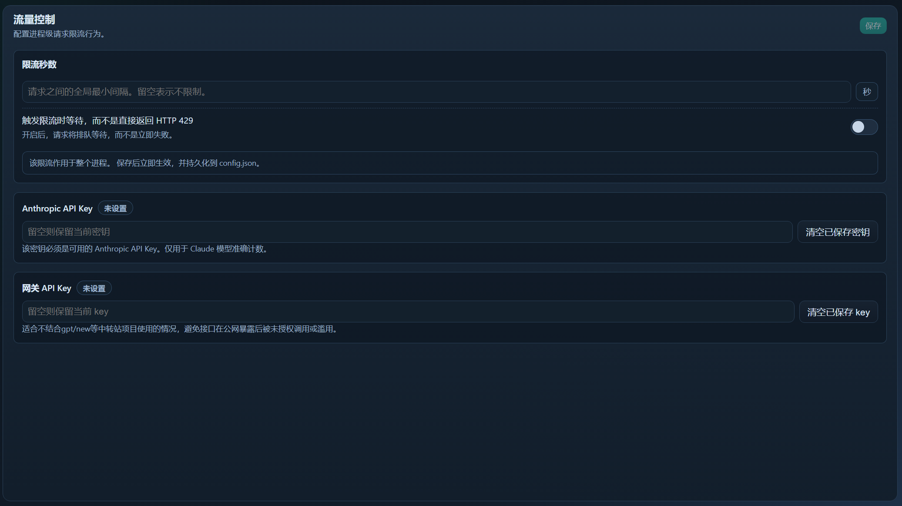

# Copilot API Proxy

**[English](README.md) | 中文**

> [!NOTE]
> **关于本分支**
> 本项目 fork 自 [ericc-ch/copilot-api](https://github.com/ericc-ch/copilot-api)。由于原作者已停止维护且不再支持新 API，我们对其进行了重新设计和重写。
> 特别感谢 [@ericc-ch](https://github.com/ericc-ch) 的原创工作和贡献！

> [!WARNING]
> 这是一个 GitHub Copilot API 的逆向代理。它不受 GitHub 官方支持，可能会意外失效。使用风险自负。

> [!WARNING]
> **GitHub 安全提示：**  
> 过度的自动化或脚本化使用 Copilot（包括通过自动化工具进行的快速或批量请求）可能会触发 GitHub 的滥用检测系统。  
> 您可能会收到 GitHub 安全团队的警告，进一步的异常活动可能导致您的 Copilot 访问权限被暂时停用。
>
> GitHub 禁止使用其服务器进行过度的自动化批量活动或任何给其基础设施带来不当负担的活动。
>
> 请查阅：
>
> - [GitHub 可接受使用政策](https://docs.github.com/site-policy/acceptable-use-policies/github-acceptable-use-policies#4-spam-and-inauthentic-activity-on-github)
> - [GitHub Copilot 条款](https://docs.github.com/site-policy/github-terms/github-terms-for-additional-products-and-features#github-copilot)
>
> 请负责任地使用此代理，以避免账户受限。

---

**注意：** 如果您正在使用 [opencode](https://github.com/sst/opencode)，则不需要此项目。Opencode 已内置支持 GitHub Copilot 提供商。

---

## 项目概述

一个 GitHub Copilot API 的逆向代理，将其暴露为 OpenAI、Anthropic 与 Gemini（兼容）服务。网关会基于模型 `supported_endpoints` 做能力驱动分流，并在必要时做协议转换，因此可与支持 OpenAI Chat Completions API、OpenAI Responses API、Anthropic Messages API 或 Gemini generateContent 接口的客户端配合使用（包括 [Claude Code](https://docs.anthropic.com/en/docs/claude-code/overview)）。

## 架构

本项目当前是“**能力驱动分流网关**”，不是单一路径透传代理：

1. 对外同时提供 OpenAI / Anthropic / Gemini（兼容）入口。
2. 对内根据模型 `supported_endpoints` 动态选择上游端点。
3. 入口协议与最终上游协议可能不同（会做双向格式转换）。



## 请求流程（当前版本）

### /v1/messages（Anthropic 入口）
- 支持 messages -> 走 `/v1/messages`
- 否则支持 responses -> 转换后走 `/responses`
- 否则 -> 转换后走 `/chat/completions`

### /v1/chat/completions（OpenAI Chat 入口）
- 支持 chat -> 走 `/chat/completions`
- 否则支持 messages -> 回退到 `/v1/messages`
- 否则支持 responses -> 回退到 `/responses`
- 若模型声明了 `supported_endpoints` 且三者都不支持 -> 返回 400
- 若模型未提供 endpoints 元数据（空/缺失）-> 默认按 chat 路径尝试

### /v1/responses（OpenAI Responses 入口）
- 仅在模型支持 responses 时放行
- 不支持直接返回 400（不做多路回退）

### /v1beta/models/{model}:generateContent / streamGenerateContent（Gemini 兼容入口）
- 当前采用 chat-only 设计：Gemini 请求统一转换到 `/chat/completions`
- 执行顺序为“先校验模型能力，再做 Gemini -> Chat 转换”
- 若模型不支持 chat，直接返回 400（不走 messages/responses 回退）
- 当前仅处理 `contents.parts.text` 文本输入

## 功能特性

- **多协议入口**：OpenAI Chat、OpenAI Responses、Anthropic Messages、Gemini（兼容）入口。
- **能力驱动分流**：基于模型 `supported_endpoints` 动态路由，不硬编码模型名。
- **双向转换层**：支持 Anthropic <-> Chat、Anthropic <-> Responses、Chat <-> Gemini（兼容）转换。
- **Web 账户管理**：通过 `/admin` 添加和管理多个 GitHub 账户。
- **多账户支持**：无需重启即可切换账户。
- **Docker 优先部署**：容器化部署，配置持久化。
- **使用量监控**：通过 `/usage` 查看使用与配额。
- **速率限制控制**：支持限流与等待策略。
- **账户类型支持**：个人 / 商业 / 企业账户。
- **链路追踪能力**：每个请求都支持 `x-trace-id`（接收或自动生成），并将同一 ID 透传为上游 `x-request-id` / `x-agent-task-id`，便于端到端排障。

## Docker 快速开始

### 使用 Docker Compose（推荐）

```bash
# 启动服务器
docker compose up -d

# 查看日志
docker compose logs -f
```

然后访问 **http://localhost:4141/admin** 添加您的 GitHub 账户。

### 使用 Docker Run

```bash
docker run -d \
  --name copilot-api \
  -p 4141:4141 \
  -v copilot-data:/data \
  --restart unless-stopped \
  ghcr.io/qlhazycoder/copilot-api:latest
```

## 账户设置

1. 使用 Docker 启动服务器
2. 在浏览器中打开 [http://localhost:4141/admin](http://localhost:4141/admin)（必须从 localhost 访问）
3. 点击"添加账户"开始 GitHub OAuth 设备流程
4. 在 GitHub 设备授权页面输入显示的代码
5. 授权完成后，您的账户将自动配置

管理面板覆盖 `Accounts`、`Models`、`Usage`、`Model Mappings`、`Settings` 五个标签页。

## Admin 页面能力

### Accounts（账户）
- 支持添加/切换/删除/拖拽排序多个 GitHub 账户。
- 账户页会按轮询周期自动刷新账户状态与用量（近实时，不是 WebSocket 推送）。
- 每个账户的用量基于该账户 token 独立拉取。



### Models（模型）
- 按 provider 分组展示模型。
- 支持”可见 / 隐藏”筛选与管理模式下的可见性切换。
- 支持双击倍率进行内联编辑（premium multiplier），用于本地用量日志统计。
- 支持按模型配置推理强度（管理页）：仅当模型声明支持的推理等级时才显示选项；客户端未显式传推理字段时，代理不会自动补参。
- 模型卡片可显示功能特性与上下文窗口等信息。







### Usage（用量）
- 提供用量概览与请求日志列表。
- 日志按当前活跃账户隔离存储，不同账号数据不混合。
- 支持按 `source`（`all` / `request`）筛选与游标分页；`endpoint` 当前为展示字段，尚非独立筛选条件。
- 可配置测试/轮询间隔；默认间隔来自配置（默认 10 分钟），测试请求默认模型为 `gpt-4o`。
- 每月日志清理为“按写入时惰性清理”（写入新日志时清理非当月数据），不是固定时刻定时任务。



### Model Mappings（模型映射）
- 支持新增、复制、删除模型映射。
- 支持把客户端模型别名映射到 Copilot 实际模型。
- 目标模型可从 `/v1/models` 动态拉取后选择。



### Settings（设置）
- 可编辑全局限流与相关配置项（环境变量仍保持更高优先级）。
- 可在页面中配置 `anthropicApiKey`，用于 Claude `/v1/messages/count_tokens` 的官方准确计数。
- 包含 Usage 测试间隔等管理配置。



## 环境变量

| 变量 | 默认值 | 描述 |
|------|--------|------|
| `PORT` | `4141` | 服务器端口 |
| `VERBOSE` | `false` | 启用详细日志（也接受 `DEBUG=true`） |
| `RATE_LIMIT` | - | 请求之间的最小间隔秒数 |
| `RATE_LIMIT_WAIT` | `false` | 达到速率限制时等待而不是返回错误 |
| `SHOW_TOKEN` | `false` | 在日志中显示令牌 |
| `PROXY_ENV` | `false` | 从环境变量使用 `HTTP_PROXY`/`HTTPS_PROXY` |

### 带选项的 Docker Compose 示例

```yaml
services:
  copilot-api:
    image: ghcr.io/qlhazycoder/copilot-api:latest
    container_name: copilot-api
    ports:
      - "4141:4141"
    volumes:
      - copilot-data:/data
    environment:
      - PORT=4141
      - VERBOSE=true
      - RATE_LIMIT=5
      - RATE_LIMIT_WAIT=true
    restart: unless-stopped

volumes:
  copilot-data:
```

如果没有通过环境变量设置 `RATE_LIMIT` / `RATE_LIMIT_WAIT`，也可以在管理页的 `Settings` 标签中配置。环境变量优先级高于页面保存的配置。

## API 端点

### OpenAI 兼容端点

| 端点 | 方法 | 描述 |
|------|------|------|
| `/v1/responses` | `POST` | OpenAI Responses API，用于生成模型响应（仅支持 responses 的模型可用） |
| `/v1/chat/completions` | `POST` | 聊天补全 API（支持能力驱动 fallback） |
| `/v1/models` | `GET` | 列出可用模型 |
| `/v1/embeddings` | `POST` | 创建文本嵌入 |

另外也提供无 `/v1` 前缀的兼容别名：`/chat/completions`、`/responses`、`/models`、`/embeddings`。

### Anthropic 兼容端点

| 端点 | 方法 | 描述 |
|------|------|------|
| `/v1/messages` | `POST` | Anthropic Messages API（支持能力驱动 fallback） |
| `/v1/messages/count_tokens` | `POST` | 令牌计数 |

### Gemini 兼容端点

| 端点 | 方法 | 描述 |
|------|------|------|
| `/v1beta/models/{model}:generateContent` | `POST` | Gemini 兼容非流式入口，内部固定转 `/chat/completions` |
| `/v1beta/models/{model}:streamGenerateContent` | `POST` | Gemini 兼容流式入口，内部固定转 `/chat/completions` 并以 SSE 返回 |

说明：Gemini 入口当前为 chat-only 设计，仅处理 `contents.parts.text` 文本输入；模型不支持 chat 时直接返回 400。

### 管理端点

| 端点 | 方法 | 描述 |
|------|------|------|
| `/admin` | `GET` | 账户管理 Web 界面（仅限 localhost） |
| `/usage` | `GET` | Copilot 使用统计和配额 |
| `/token` | `GET` | 当前 Copilot 令牌 |

## 工具支持范围

本项目当前没有实现完整的 Claude Code / Codex 工具协议兼容层。工具支持以“尽量兼容”为主，范围主要受 GitHub Copilot 上游可稳定接受的工具形态限制。

- **明确支持**：通过 OpenAI 兼容或 Anthropic 兼容请求传入的标准 `function` 工具。
- **Responses 内建工具**：已支持 Copilot/OpenAI 风格的内建工具，包括 `web_search`、`web_search_preview`、`file_search`、`code_interpreter`、`image_generation`、`local_shell`，前提是上游模型和 endpoint 本身支持。
- **特殊兼容**：自定义 `apply_patch` 会被规范化为 `function` 工具，以提升兼容性。
- **有限的文件编辑兼容**：常见自定义文件编辑工具名，如 `write`、`write_file`、`writefiles`、`edit`、`edit_file`、`multi_edit`、`multiedit`，会被规范化为 `function` 工具，避免在代理层被直接过滤掉。
- **不保证兼容**：Claude Code、Codex、`superpowers` 或其他 agent 框架里的 skill 专用工具，如果依赖客户端自定义 schema、结果格式或特定执行语义，仍然可能失败，因为 Copilot 上游未必支持这些协议。
- **当前限制**：本项目还没有提供完整的 Claude Code / Codex 文件工具端到端兼容层。如果某个 skill 依赖私有工具契约，仍然需要额外做适配。

## 与 Claude Code 配合使用

通过创建 `.claude/settings.json` 文件来配置 Claude Code 使用此代理：

```json
{
  "env": {
    "ANTHROPIC_BASE_URL": "http://localhost:4141",
    "ANTHROPIC_AUTH_TOKEN": "sk-xxxx"
  },
  "model": "opus",
  "permissions": {
    "deny": ["WebSearch"]
  }
}
```

### 在管理页面配置模型映射

现在不需要再把模型映射硬编码在 `.claude/settings.json` 里。打开 `/admin`，切换到 `Model Mappings` 页面后，即可把 Claude Code 使用的模型别名映射到实际的 Copilot 模型。

这是目前更推荐的方式，适合统一管理 `haiku`、`sonnet`、`opus`、带日期的 Claude 模型 ID，以及其他客户端侧使用的模型名称，而不必反复修改本地 Claude Code 配置。


更多选项：[Claude Code 设置](https://docs.anthropic.com/en/docs/claude-code/settings#environment-variables)

### 可选：安装 copilot-api 的 Claude Code 插件

如果您希望 Claude Code 在 `SubagentStart` hook 中注入一个额外 marker，帮助 `copilot-api` 更稳定地区分 initiator override，可以直接从本仓库安装可选插件：

```bash
/plugin marketplace add https://github.com/QLHazyCoder/copilot-api.git
/plugin install copilot-api-subagent-marker@copilot-api-marketplace
```

这个插件只是一个轻量 hook 辅助层，不负责启动或管理 `copilot-api` 服务本身。服务端仍然建议按本文档中的 Docker 方式部署。

## 配置文件 (config.json)

配置文件存储在容器内的 `/data/copilot-api/config.json`（通过 Docker volume 持久化）。

```json
{
  "accounts": [
    {
      "id": "12345",
      "login": "github-user",
      "avatarUrl": "https://...",
      "token": "gho_xxxx",
      "accountType": "individual",
      "createdAt": "2025-01-27T..."
    }
  ],
  "activeAccountId": "12345",
  "extraPrompts": {
    "gpt-5-mini": "<exploration prompt>"
  },
  "smallModel": "gpt-5-mini",
  "modelReasoningEfforts": {
    "gpt-5-mini": "xhigh"
  },
  "anthropicApiKey": "sk-ant-..."
}
```

### 配置选项

| 键 | 描述 |
|----|------|
| `accounts` | 已配置的 GitHub 账户列表 |
| `activeAccountId` | 当前活跃账户 ID |
| `extraPrompts` | 附加到系统消息的每模型提示 |
| `smallModel` | 预热请求的备用模型（默认：`gpt-5-mini`） |
| `modelReasoningEfforts` | 管理页保存的每模型推理强度偏好（`none`、`minimal`、`low`、`medium`、`high`、`xhigh`）；客户端未传推理字段时不会被代理自动补入 |
| `modelMapping` | 模型别名映射（管理页 `Model Mappings` 的持久化配置） |
| `premiumModelMultipliers` | 模型 premium 计费倍率配置 |
| `modelCardMetadata` | 模型卡片扩展元数据（如 context window / features） |
| `hiddenModels` | 在管理页中隐藏的模型列表 |
| `useFunctionApplyPatch` | 是否把 `apply_patch` 规范化为 `function` 工具（默认启用） |
| `anthropicApiKey` | 可选 Anthropic API key，用于 Claude `/v1/messages/count_tokens` 的官方准确计数 |
| `auth.apiKey` | 可选网关 API key；配置后受保护路由需携带 `x-api-key` 或 `Authorization: Bearer <key>` |
| `rateLimitSeconds` | 当未设置 `RATE_LIMIT` 环境变量时，保存的全局最小请求间隔 |
| `rateLimitWait` | 当未设置 `RATE_LIMIT_WAIT` 环境变量时，命中限流后的保存等待策略 |
| `usageTestIntervalMinutes` | `/usage` 页面测试/轮询间隔分钟数（可为 `null`） |

## 开发

### 前置要求

- Bun >= 1.2.x
- 拥有 Copilot 订阅的 GitHub 账户

### 命令

```bash
# 安装依赖
bun install

# 启动开发服务器（支持热重载）
bun run dev

# 类型检查
bun run typecheck

# 代码检查
bun run lint
bun run lint --fix

# 运行测试
bun test

# 生产构建
bun run build

# 检查未使用的代码
bun run knip
```

## 使用技巧

- **速率限制**：使用 `RATE_LIMIT` 防止触发 GitHub 的速率限制。设置 `RATE_LIMIT_WAIT=true` 可以队列请求而不是返回错误。
- **商业/企业账户**：账户类型在 OAuth 流程中自动检测。
- **多账户**：通过 `/admin` 添加多个账户，并根据需要在它们之间切换。
- **Claude token 计数**：当配置了 `anthropicApiKey`（或环境变量 `ANTHROPIC_API_KEY`）时，`/v1/messages/count_tokens` 会优先调用 Anthropic 官方计数接口；若失败会自动回退本地估算。
- **Trace 请求头**：客户端可主动传入 `x-trace-id`；若未传或格式非法，网关会自动生成并在响应头回写，同时把该 ID 透传到上游用于链路关联。
- **网关 API key 鉴权**：当配置了 `auth.apiKey` 后，受保护路由需要携带 `x-api-key` 或 `Authorization: Bearer <key>`。

## Premium Interaction 说明

- **`premium_interactions` 来自 Copilot/GitHub 上游计量，不是这个代理自行定义的计费模型。** `/usage` 端点只是透传并展示上游返回的使用量数据。
- **Skill、hook、plan、subagent 等工作流可能会增加 `premium_interactions`。** 当客户端使用 Claude Code subagent 或 `superpowers` 一类能力时，Copilot 可能会把主交互和子代理交互视为不同的计费交互。
- **预热请求也可能被上游计入。** 本项目已经尝试通过将部分 warmup 风格请求切到 `smallModel` 来降低影响，但无法完全控制 Copilot 的上游计量方式。
- **这不是代理层可以彻底修复的问题。** 代理可以通过整理消息结构来尽量减少误计数，但无法覆盖 Copilot 在上游如何统计 interaction。
- **如果使用 subagent 后看到计数增加，并不代表代理重复转发了同一条业务请求。** 在正常路径下，代理对选定的上游 endpoint 只会转发一次请求，但 Copilot 仍可能对整个工作流统计多个 interaction。

## CLAUDE.md 推荐内容

请在 `CLAUDE.md` 中包含以下内容（供 Claude 使用）：

- 禁止直接向用户提问，必须使用 AskUserQuestion 工具。
- 一旦确认任务完成，必须使用 AskUserQuestion 工具让用户确认。用户如果对结果不满意可能会提供反馈，您可以利用这些反馈进行改进并重试。
